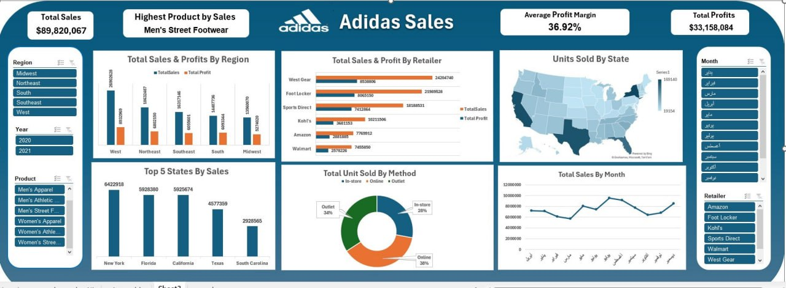

# 👟 Adidas Sales Analysis & Interactive Dashboard

## 1. 📊 Dashboard Preview

> **Key Performance Indicators (KPIs):**
> * **Total Sales:** $89.8 Million
> * **Total Profit:** $33.1 Million
> * **Avg. Profit Margin:** 36.92%
> * **Top Product:** Men's Street Footwear

---

## 2. 📝 Project Overview & Dataset
This project analyzes an Adidas sales dataset containing detailed information on sales transactions across the United States. The goal is to identify trends, top-performing products, and the most profitable sales channels to help in future strategic planning.

---

## 3. 🛠️ Data Cleaning & Preparation (My Professional Touch)
Before building the dashboard, I performed a rigorous data cleaning process to ensure accuracy:
* **Handling Missing Data:** Identified and dropped rows with missing values in `Price per Unit`.
* **Feature Engineering:** Extracted `Year`, `Month`, and `Day` from the Invoice Date and created a custom `Season` column.
* **Typo Fixes:** Corrected spelling errors in the `Product` names to prevent duplicate categories.
* **Data Transformation:** Cleaned currency symbols ($) and commas from numeric columns and converted them to appropriate types (Integer/Float).
* **Dealing with Returns:** Identified transactions with zero sales (refunds) and excluded them to avoid skewing the revenue data.
* **Math Corrections:** Discovered and recalculated incorrect values in `Total Sales` and `Operating Profit` using verified formulas.

---

## 4. 🔍 Business Questions Addressed
* How do sales vary across different retailers (West Gear vs. Foot Locker)?
* Which Region and State generate the highest Operating Profit?
* What is the impact of Seasonality on sales performance?
* Which Sales Method (Online, Outlet, or In-store) is most effective?
* What is the average price point for each product category?

---

## 5. 💡 Key Insights & Conclusion
Based on the analysis and the interactive dashboard:
* **Market Leaders:** **West Gear** and **Foot Locker** dominate the market, together capturing over 51% of total sales.
* **Geographic Winners:** The **West Region** is the most profitable (30% of sales), with **New York** and **California** being the top-performing states.
* **Top Products:** **Men’s Street Footwear** and **Women’s Apparel** are the primary revenue drivers.
* **Seasonality Trends:** Sales peak significantly during **Summer** (29%) and **Winter** (24%), while Autumn and Spring show a noticeable decline.
* **Digital Shift:** **Online sales** have become the leading channel (37%), proving the importance of e-commerce for Adidas.
* **Yearly Growth:** 2021 saw a massive spike compared to 2020, marking a strong recovery from the Covid-19 impact.

---

## 📂 Project Files
* `Adidas Sales.csv`: The cleaned dataset used for analysis.
* `Adidas_Sales_Dashboard.jpg`: High-resolution preview of the final dashboard.
